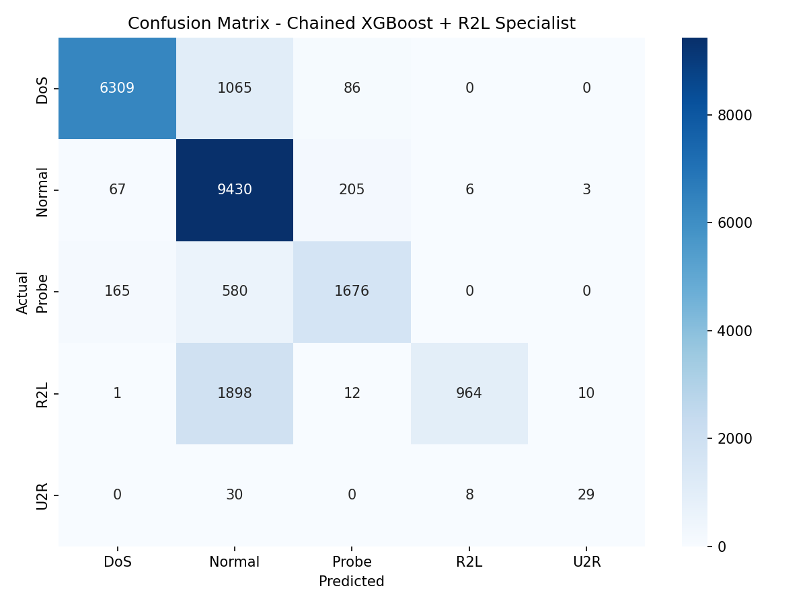

# Assignment Report

---

**Course:** Advanced Python (ICS0019)

**Team members:** Oleksii Kolomoiets, Daniil Yussopov, Maksym Fedorov

**Date:** [24.05.2026]

Repository link: [https://github.com/OleksiiKolmoiets/Network-Intrusion-Detection-System]

---

## 1. Approach

### 1.1 Strategy Overview

The goal of this project was to build a machine learning model for network intrusion detection using the NSL-KDD dataset. The task was a five-class classification problem with the categories **Normal**, **DoS**, **Probe**, **R2L**, and **U2R**. The main difficulty was the strong class imbalance: Normal and DoS traffic had many examples, while R2L and especially U2R had very few training samples. Because of this, the main evaluation metric was **macro F1-score**, since it gives equal importance to every class.

Our group split the work between three members. Each member tested a different main approach:

| Group approach | Main model | Main idea |
|---|---|---|
| Approach 1 | MLP | Neural network with scaling, SMOTE, feature engineering, feature selection, and tuning |
| Approach 2 | XGBoost | Gradient boosting with SMOTENC, manual weights, engineered features, and a chained R2L specialist |
| Approach 3 | LightGBM | Gradient boosting with SMOTEENN, class weighting, engineered features, and hyperparameter tuning |

This split allowed us to compare different modelling strategies instead of relying on only one algorithm. MLP was useful for testing a neural-network approach, while XGBoost and LightGBM were chosen because gradient boosting models usually perform well on structured tabular datasets.

### 1.2 Preprocessing

The dataset was loaded using the provided NSL-KDD train and test files. The original attack labels were mapped into the five required categories: **Normal**, **DoS**, **Probe**, **R2L**, and **U2R**. The `level` column was removed because it is not a feature, and `num_outbound_cmds` was removed because it is always zero and therefore does not provide useful information.

The three categorical columns were handled depending on the model. For MLP, one-hot encoding was used because neural networks need a numerical representation that does not create artificial ordering between categories. For LightGBM, label encoding was used because tree-based models can work with encoded categorical values. For XGBoost, SMOTENC was used before one-hot encoding so that oversampling could handle categorical features more correctly.

Several engineered features were tested. In the MLP approach, features such as `byte_ratio`, `total_bytes`, `logged_in_src_bytes`, `login_failure_rate`, `root_compromise_ratio`, `mean_error_rate`, `max_error_rate`, `mean_host_rate`, and `content_activity` were added. In the LightGBM approach, features such as `bytes_ratio`, `error_rate_sum`, `host_srv_ratio`, `total_bytes`, `host_error_sum`, and `srv_diff_ratio` were added. In the XGBoost approach, domain-inspired features were added to represent byte behaviour, login risk, privilege-risk indicators, compromise indicators, and host/service traffic pressure.

### 1.3 Class Imbalance Handling

Class imbalance was the main challenge in the project. The training set contained 67,343 Normal samples and 45,927 DoS samples, but only 995 R2L samples and 52 U2R samples. Therefore, a model could achieve acceptable accuracy while still missing the most important rare attacks.

Different imbalance-handling methods were tested across the three approaches:

| Approach | Imbalance handling |
|---|---|
| MLP | SMOTE oversampling inside an `imblearn` pipeline |
| XGBoost | SMOTENC, manual sample weights, and a chained R2L specialist |
| LightGBM | SMOTEENN combined with `class_weight='balanced'` |

SMOTE and SMOTENC helped by creating synthetic minority samples. SMOTEENN also cleaned noisy samples using Edited Nearest Neighbours. For XGBoost, the main remaining weakness was that many R2L samples were classified as Normal, so a second binary specialist model was added to review Normal predictions and override some of them to R2L.

---

## 2. Experiments

**Total number of main approaches: 3**

**Baseline Random Forest:**  
We first used Random Forest results as a baseline. The default Random Forest reached a test macro F1-score of **0.5009**, while Random Forest with balanced class weights reached **0.4779**. This showed that simple class weighting alone was not enough. The model performed reasonably on Normal and DoS traffic, but it still performed very poorly on R2L and U2R.

**MLP approach:**  
The MLP approach tested whether a neural network could learn useful non-linear traffic patterns after proper preprocessing. A basic MLP reached **0.5131** macro F1. Adding SMOTE improved the score to **0.5231**, and adding one-hot encoding improved it further to **0.5689**. After feature engineering, correlation filtering, variance filtering, SelectKBest feature selection, SMOTE, and RandomizedSearchCV tuning, the MLP reached **0.5956**. A two-stage version using an additional Normal-vs-R2L Random Forest specialist slightly improved the result to **0.5984**.

**LightGBM approach:**  
The LightGBM approach tested gradient boosting with SMOTEENN and class weighting. A baseline LightGBM model without resampling reached only **0.4516** macro F1 because it almost completely failed on rare classes. Adding SMOTEENN and `class_weight='balanced'` increased the score to **0.6390**. Using only `class_weight='balanced'` without SMOTEENN reached **0.5816**, which showed that class weighting helped but was weaker than combining it with resampling. After RandomizedSearchCV tuning, the final LightGBM + SMOTEENN model reached **0.6727** macro F1.

**XGBoost approach:**  
The XGBoost approach was the strongest final solution. XGBoost was chosen because it is a strong tree-based model for tabular data. SMOTENC, manual sample weights, one-hot encoding, and feature engineering improved the model substantially, but R2L was still often confused with Normal. To address this, a chained R2L specialist was added. The first XGBoost model made the normal five-class prediction, and the second binary XGBoost model reviewed samples predicted as Normal and changed some of them to R2L when the R2L probability was high enough. This final approach reached the best test macro F1-score of **0.7049**.

### Experiments Summary Table

| # | Description | Algorithm | Imbalance Handling | Macro F1 (test) |
|---|-------------|-----------|-------------------|-----------------|
| 1 | Random Forest baseline | Random Forest | None | 0.5009 |
| 2 | Random Forest balanced baseline | Random Forest | `class_weight='balanced'` | 0.4779 |
| 3 | Basic MLP | MLPClassifier | None/basic preprocessing | 0.5131 |
| 4 | MLP + SMOTE | MLPClassifier | SMOTE | 0.5231 |
| 5 | MLP + SMOTE + One-Hot Encoding | MLPClassifier | SMOTE | 0.5689 |
| 6 | Tuned MLP with engineered features | MLPClassifier | SMOTE | 0.5956 |
| 7 | Two-stage MLP + R2L specialist | MLP + Random Forest specialist | SMOTE + specialist model | 0.5984 |
| 8 | Baseline LightGBM | LightGBM | None | 0.4516 |
| 9 | LightGBM + class weight only | LightGBM | `class_weight='balanced'` | 0.5816 |
| 10 | LightGBM + SMOTEENN | LightGBM | SMOTEENN + class weight | 0.6390 |
| 11 | Tuned LightGBM + SMOTEENN | LightGBM | SMOTEENN + class weight | 0.6727 |
| 12 | XGBoost + chained R2L specialist | XGBoost | SMOTENC + manual weights + specialist model | **0.7049** |

---

## 3. Final Results

### 3.1 Best Model

The best final model was the **XGBoost model with SMOTENC, manual sample weights, engineered features, one-hot encoding, and a chained R2L specialist**.

The model used a two-stage structure. First, the main XGBoost classifier predicted one of the five classes. Then, a binary R2L specialist reviewed samples that the main model predicted as Normal. This was useful because the confusion matrix and classification reports showed that R2L attacks were often misclassified as Normal. The specialist model helped recover some of these missed R2L cases.

### 3.2 Final Macro F1-Score

| Metric | Score |
|--------|-------|
| Macro F1 (test) | **0.7049** |
| Macro F1 (CV) | 0.9314 (±0.0205) |

### 3.3 Classification Report

| Category | Precision | Recall | F1-Score | Support |
|----------|-----------|--------|----------|---------|
| DoS      | 0.96 | 0.85 | 0.90 | 7,460 |
| Normal   | 0.73 | 0.97 | 0.83 | 9,711 |
| Probe    | 0.85 | 0.69 | 0.76 | 2,421 |
| R2L      | 0.99 | 0.33 | 0.50 | 2,885 |
| U2R      | 0.69 | 0.43 | 0.53 | 67 |
| **Macro average** | **0.84** | **0.66** | **0.70** | **22,544** |
| **Weighted average** | **0.85** | **0.82** | **0.80** | **22,544** |

The final model performed best on DoS and Normal traffic. Probe detection was also acceptable. The most important improvement was in R2L, where the final chained XGBoost model achieved an F1-score of **0.50**, which was better than the other tested approaches. However, the R2L recall was still only **0.33**, meaning many R2L attacks were still missed. U2R achieved an F1-score of **0.53**, which is reasonable considering that there were only 52 U2R records in the training set and 67 in the test set.

### 3.4 Confusion Matrix

The final confusion matrix is included below:

The confusion matrix confirms that the model detects Normal and DoS traffic well. The main remaining weakness is still R2L, because many R2L samples are classified as Normal. This is expected because R2L attacks often look similar to legitimate connections and are much less represented in the training data.

---

## 4. Cross-Validation vs. Test Score

| Model | CV macro F1 | Test macro F1 | Difference |
|---|---:|---:|---:|
| Two-stage MLP + R2L specialist | 0.9022 ± 0.0358 | 0.5984 | 0.3038 |
| Tuned LightGBM + SMOTEENN | 0.9394 ± 0.0160 | 0.6727 | 0.2667 |
| XGBoost + chained R2L specialist | 0.9314 ± 0.0205 | 0.7049 | 0.2265 |

The cross-validation scores were much higher than the final test scores for all three approaches. This gap is expected for the NSL-KDD task because the KDDTest+ set contains attack types and distributions that are not fully represented in the training data. Cross-validation only evaluates performance on splits of the training data, so it is easier than testing on KDDTest+.

The gap was also influenced by resampling. Methods such as SMOTE, SMOTENC, and SMOTEENN make the training distribution more balanced, while the official test set remains imbalanced and includes harder unseen examples. Therefore, the cross-validation scores show that the models learned the training distribution well, but the lower test scores show that generalization to unseen attack variants remained difficult.

---

## 5. What Worked and What Didn't

### What had the biggest positive impact?

The biggest positive impact came from handling class imbalance and focusing on rare classes. For MLP, SMOTE and one-hot encoding improved the result from **0.5131** to **0.5689**, and further tuning improved it to **0.5956**. For LightGBM, SMOTEENN had a very strong effect, improving macro F1 from **0.4516** to **0.6390**. For XGBoost, the best improvement came from combining feature engineering, SMOTENC, manual weights, and the chained R2L specialist. This final XGBoost approach achieved the best score of **0.7049**.

### What surprisingly didn't help as much?

Simple class weighting did not help as much as expected. The balanced Random Forest baseline scored **0.4779**, which was worse than the default Random Forest baseline. In LightGBM, class weighting alone improved the score to **0.5816**, but it was still weaker than SMOTEENN combined with class weighting. This showed that weighting alone was not enough to solve the minority-class problem.

The two-stage MLP + Random Forest specialist also helped only slightly. It improved the MLP score from **0.5956** to **0.5984**, but the improvement was small. This suggests that the main MLP model had already captured most of what it could from the available features, while the XGBoost specialist was more effective for the Normal/R2L distinction.

### What would you try with more time?

With more time, the next step would be to improve R2L and U2R detection further. The best direction would be to continue developing specialist models or threshold tuning for rare classes. For example, we could tune separate decision thresholds for R2L and U2R to increase recall, even if this creates more false positives.

Another useful direction would be an ensemble that combines the three approaches. Since MLP, XGBoost, and LightGBM learn patterns differently, a soft-voting or stacking ensemble could potentially combine their strengths. More domain-specific feature engineering could also help, especially features related to login behaviour, failed access attempts, privilege escalation indicators, and unusual service-specific patterns.

Overall, the project showed that accuracy alone is not suitable for imbalanced intrusion detection. Macro F1 gave a better view of the real model quality because it exposed weaknesses on R2L and U2R. The final XGBoost chained model was selected because it provided the best balance across all five classes.

---

## Appendix: Environment

- **Python:** Python 3.13
- **Main libraries:** scikit-learn, imbalanced-learn, XGBoost, LightGBM, pandas, numpy, matplotlib
- **Random seed:** 42 where applicable
- **Dataset:** NSL-KDD KDDTrain+ and KDDTest+
- **Main evaluation metric:** macro F1-score

